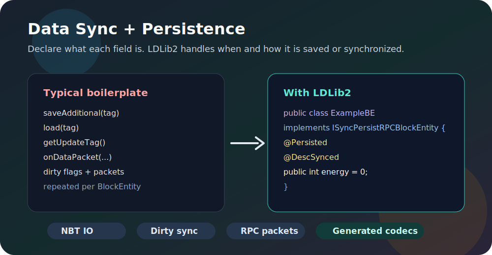
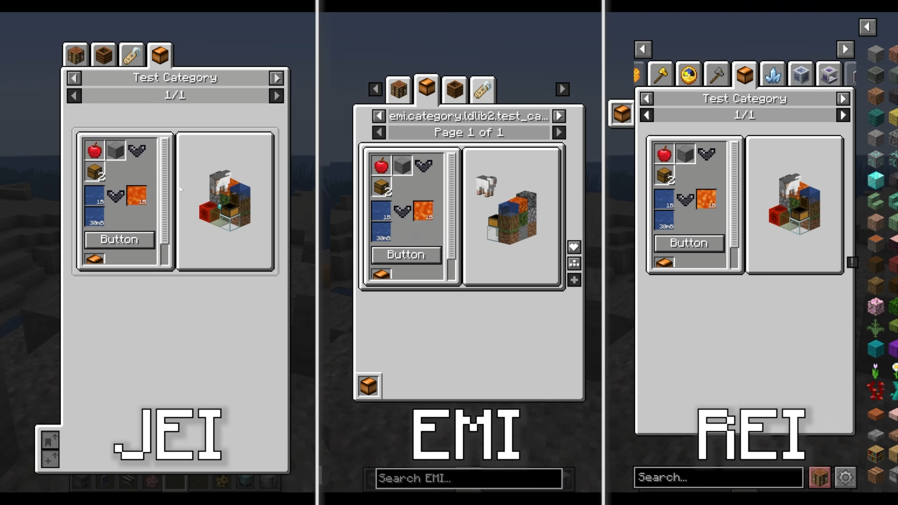

# LDLib2

<div align="center">

**A modern Minecraft modding library for UI, rendering, synchronization, persistence, and in-game editors.**

[](https://github.com/Low-Drag-MC/LDLib2/stargazers)
[](https://www.curseforge.com/minecraft/mc-mods/ldlib)
[](https://modrinth.com/mod/ldlib)
[](https://maven.firstdark.dev/snapshots/com/lowdragmc/ldlib2/)
[](https://neoforged.net/)
[](LICENSE)

[Documentation](https://low-drag-mc.github.io/LowDragMC-Doc/en/ldlib2/) |
[Java Integration](https://low-drag-mc.github.io/LowDragMC-Doc/en/ldlib2/java_integration.html) |
[UI Guide](https://low-drag-mc.github.io/LowDragMC-Doc/en/ldlib2/ui/) |
[Discord](https://discord.com/invite/sDdf2yD9bh) |
[CurseForge](https://www.curseforge.com/minecraft/mc-mods/ldlib) |
[Modrinth](https://modrinth.com/mod/ldlib)

</div>

---

LDLib2 is a complete rewrite of the original [LDLib](https://github.com/Low-Drag-MC/LDLib-MultiLoader), redesigned around modern Minecraft and NeoForge development. It gives mod authors a higher-level foundation for building UI, in-game tools, renderer-backed content, synchronized data, and persistent runtime systems without rebuilding the same infrastructure in every project.

## Feature Highlights

<table>
<tr>
<td>
<a href="https://www.youtube.com/watch?v=Ic5H3YoVPjQ"></a><br>
<strong><a href="https://low-drag-mc.github.io/LowDragMC-Doc/en/ldlib2/ui/">LDLib2 UI</a></strong><br>
Build Minecraft screens with Taffy-powered layout, LSS stylesheets, reusable components, XML definitions, data bindings, RPC events, and HUD overlays.
</td>
<td>
<a href="https://low-drag-mc.github.io/LowDragMC-Doc/en/ldlib2/sync/"></a><br>
<strong><a href="https://low-drag-mc.github.io/LowDragMC-Doc/en/ldlib2/sync/">Data Synchronization and Persistence</a></strong><br>
Annotate fields with <code>@Persisted</code>, <code>@DescSynced</code>, and RPC helpers to generate NBT IO, codecs, dirty-field sync, and packet flow with minimal boilerplate.
</td>
</tr>
<tr>
<td>
<a href="https://low-drag-mc.github.io/LowDragMC-Doc/en/ldlib2/node-graph-toolkit/"></a><br>
<strong><a href="https://low-drag-mc.github.io/LowDragMC-Doc/en/ldlib2/node-graph-toolkit/">Node Graph Toolkit</a></strong><br>
Create in-game graph editors with nodes, ports, wires, variables, subgraphs, blackboards, undoable commands, and resource-backed graph assets.
</td>
<td>
<a href="https://low-drag-mc.github.io/LowDragMC-Doc/en/ldlib2/editor/"></a><br>
<strong><a href="https://low-drag-mc.github.io/LowDragMC-Doc/en/ldlib2/editor/">In-game Editor Framework</a></strong><br>
Build Unity-, Blender-, or Blockbench-style tools with dockable views, project files, resource browsers, inspectors, history, settings, and custom editor panels.
</td>
</tr>
<tr>
<td>
<a href="https://low-drag-mc.github.io/LowDragMC-Doc/en/ldlib2/configurable/"></a><br>
<strong><a href="https://low-drag-mc.github.io/LowDragMC-Doc/en/ldlib2/configurable/">Configurable</a></strong><br>
Turn annotated Java objects into inspector-ready property panels, including ranges, selectors, lists, resource locations, search fields, undo history, and persistence.
</td>
<td>
<a href="https://low-drag-mc.github.io/LowDragMC-Doc/en/ldlib2/ui/xei_support.html"></a><br>
<strong><a href="https://low-drag-mc.github.io/LowDragMC-Doc/en/ldlib2/ui/xei_support.html">Rendering and Integrations</a></strong><br>
Use LDLib2's shader, texture, model rendering, scene, and editor utilities together with common modding workflows such as JEI, REI, EMI, KubeJS, and Java plugin entry points.
</td>
</tr>
</table>

## Java Integration

LDLib2 is published to the FirstDark Maven snapshots repository.

```gradle
repositories {
    maven { url = "https://maven.firstdark.dev/snapshots" }
}

dependencies {
    implementation("com.lowdragmc.ldlib2:ldlib2-neoforge-${minecraft_version}:${ldlib2_version}:all")
}
```

For LDLib2 versions before `2.2.1`, disable transitive dependencies and add Yoga manually:

```gradle
dependencies {
    implementation("com.lowdragmc.ldlib2:ldlib2-neoforge-${minecraft_version}:${ldlib2_version}:all") {
        transitive = false
    }
    compileOnly("org.appliedenergistics.yoga:yoga:1.0.0")
}
```

Recommended project variables:

```properties
minecraft_version=1.21.1
ldlib2_version=2.2.26
```

### LDLib Plugin Entry Point

Create a plugin class when your mod needs to register LDLib2 resources, integrations, or startup hooks.

```java
import com.lowdragmc.lowdraglib2.plugin.ILDLibPlugin;
import com.lowdragmc.lowdraglib2.plugin.LDLibPlugin;

@LDLibPlugin
public class MyLDLibPlugin implements ILDLibPlugin {
    @Override
    public void onLoad() {
        // Register LDLib2 extensions here.
    }
}
```

## Quick UI Example

This creates a small `ModularUI` with a label, a button, and a styled root element.

```java
public class MyScreenUi {
    public static ModularUI createUi() {
        var root = new UIElement()
                .layout(layout -> layout.paddingAll(7).gapAll(5))
                .style(style -> style.background(Sprites.BORDER));

        root.addChildren(
                new Label().setText("My First LDLib2 UI"),
                new Button()
                        .setText("Click Me")
                        .setOnClick(event -> {
                            // Handle the click here.
                        })
        );

        return ModularUI.of(UI.of(root));
    }
}
```

For a full walkthrough, see the [UI Getting Started guide](https://low-drag-mc.github.io/LowDragMC-Doc/en/ldlib2/ui/getting_start.html).

## Developer Tools

If you develop with LDLib2, install the LDLib Dev Tool IDEA plugin for editor assistance around LDLib2-specific files and annotations. The [Java Integration guide](https://low-drag-mc.github.io/LowDragMC-Doc/en/ldlib2/java_integration.html) covers code highlighting, syntax checks, jump-to-definition, autocomplete, and annotation support.

## Migrating from LDLib

LDLib2 is not a small patch over LDLib. It removes old systems and rebuilds the core architecture for Minecraft `1.21+`.

- Legacy UI and outdated framework pieces have been removed.
- UI layout, styling, events, and data flow have been redesigned.
- Documentation and examples are written around the new architecture.
- Compatibility work focuses on modern NeoForge and current modding integrations.

## Links

- [Documentation](https://low-drag-mc.github.io/LowDragMC-Doc/en/ldlib2/)
- [GitHub repository](https://github.com/Low-Drag-MC/LDLib2)
- [CurseForge project](https://www.curseforge.com/minecraft/mc-mods/ldlib)
- [Modrinth project](https://modrinth.com/mod/ldlib)
- [Discord community](https://discord.com/invite/sDdf2yD9bh)
- [Original LDLib](https://github.com/Low-Drag-MC/LDLib-MultiLoader)

## License

LDLib2 is licensed under the [LGPL-3.0 license](LICENSE).
